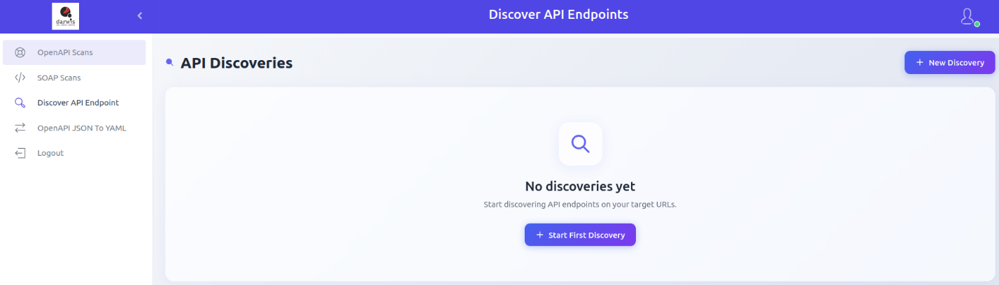
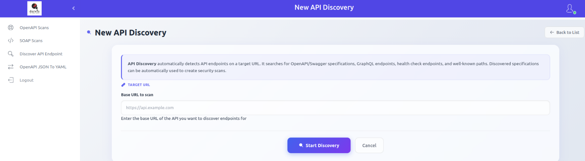
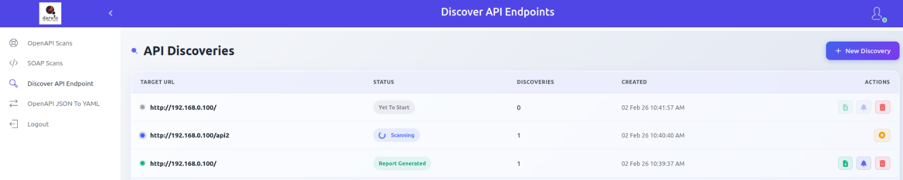
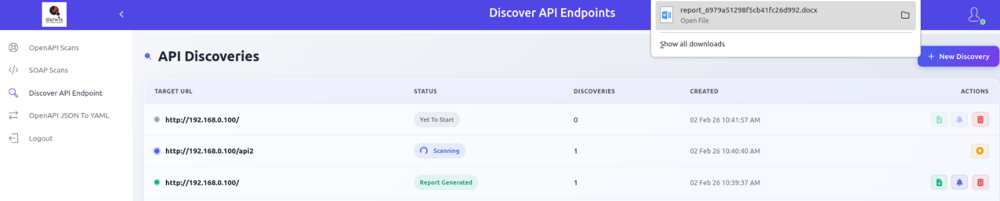
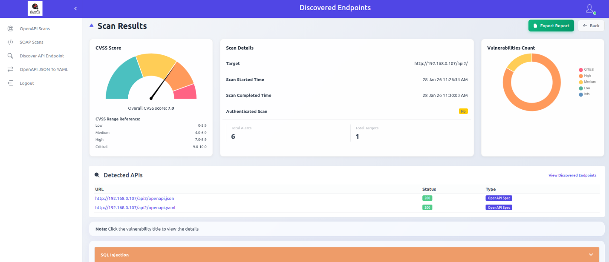
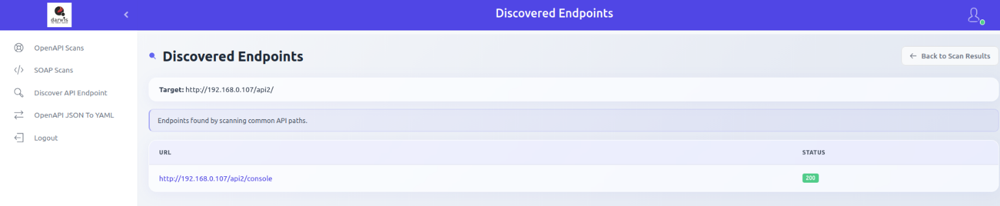
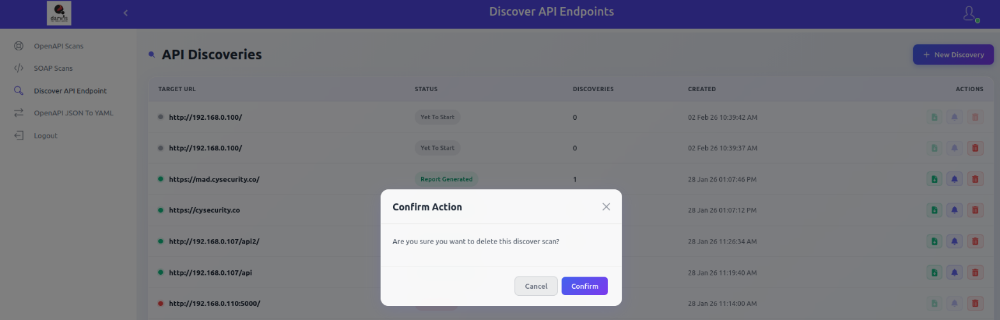

# API Discovery

API Discovery scans a target URL to automatically identify available API endpoints. It detects OpenAPI/Swagger definitions, GraphQL endpoints, health check paths, and other commonly used API routes. Discovered API specifications can then be used to run security scans.

## Starting a Discovery

From the sidebar, click **Discover API Endpoint**. If no discoveries exist, click **Start First Discovery**. Otherwise, click **New Discovery** in the top-right corner.

Enter the target URL and click **Start Discovery**.

## Viewing Discoveries

Click **Discover API Endpoint** in the sidebar to view all discovery runs.

Each row shows:

| Column | Description |
|--------|-------------|
| **Target URL** | The URL that was scanned for API endpoints |
| **Status** | In progress, completed, failed, or stopped |
| **Discoveries** | Number of endpoints discovered |
| **Created** | Date and time the discovery was created |
| **Actions** | Report, View Results, Delete |

## Report

Download discovered endpoints in document format.

## Scan Results

Click **View Results** to view detected APIs, discovered endpoints, and any scan results found at those endpoints.

### Discovered Endpoints

Click **View Discovered Endpoints** in the detected APIs section to see all endpoints found by scanning common API paths.

## Deleting a Discovery

Click the **Delete** icon to remove a discovery entry.

