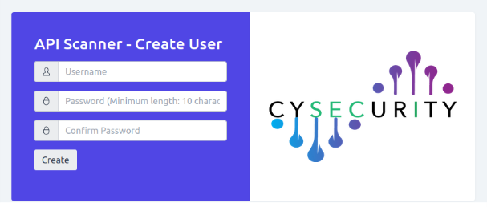
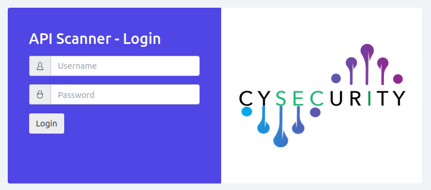

# Getting Started

## Accessing the Panel

Open a browser and navigate to:

```
https://<your-host>:4455
```

> [!NOTE]
> If using a self-signed certificate, your browser will show a security warning. Accept it to proceed.

## First-Time Setup

On first access, you will be prompted to create an account. Enter a username, a password (minimum 10 characters), and confirm the password, then click **Create**.



## Login

After the account is created, enter your username and password to log in.


