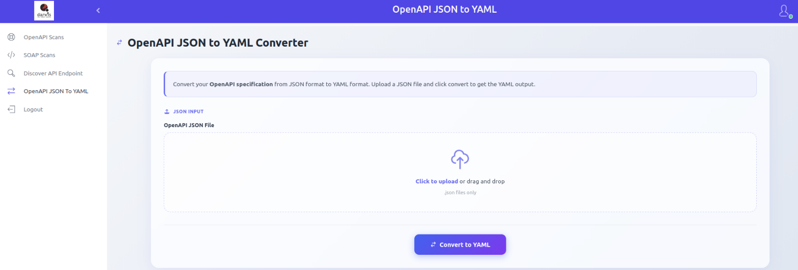
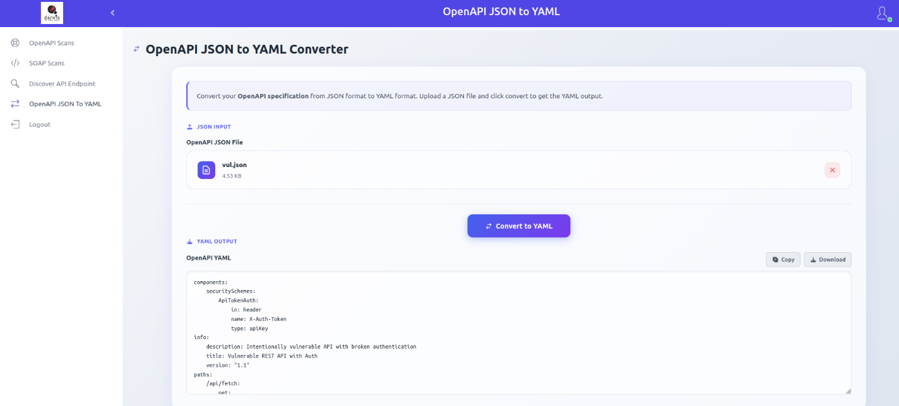

# OpenAPI JSON to YAML Converter

The OpenAPI JSON to YAML Converter transforms OpenAPI specification files from JSON to YAML format.

## Usage

From the sidebar, click **OpenAPI JSON To YAML**.

Select your OpenAPI JSON file by clicking **Click to upload** or by dragging and dropping it, then click **Convert to YAML**.

The YAML output is displayed in the panel. You can copy it to your clipboard or download it as a file.

