# OpenAPI Scan

OpenAPI Scan analyzes REST APIs for security vulnerabilities. Upload an OpenAPI (Swagger) specification file in YAML or JSON format that defines your API endpoints, operations, and request/response formats. The scanner discovers and tests all exposed endpoints for common vulnerabilities.

## Prerequisites

- An OpenAPI definition file (`.json`, `.yaml`, or `.yml`) for the target API.
- The OpenAPI file must accurately reflect the deployed API for complete and reliable scan results.

## Adding a Scan

From the sidebar, click **OpenAPI Scans**. If no scans exist, click **Start First Scan**. Otherwise, click **New Scan** in the top-right corner.

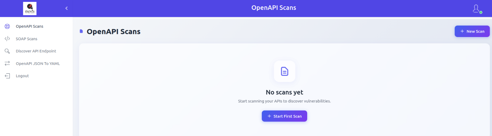

Select your OpenAPI file by clicking **Click to upload** or by dragging and dropping it.

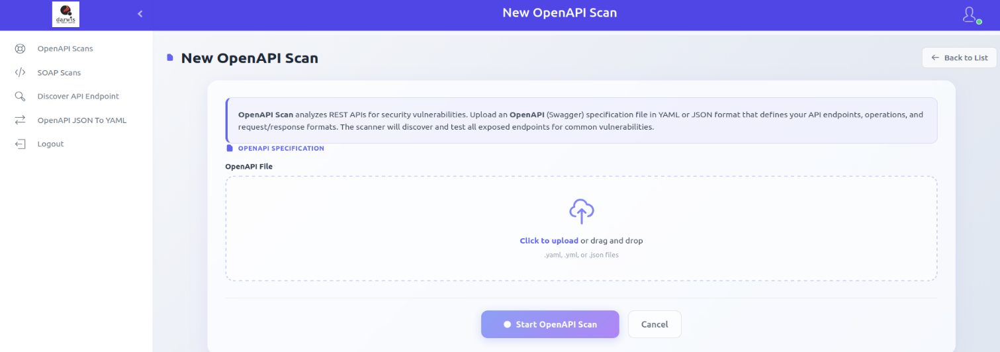

### Unauthenticated Scan

Tests API endpoints without authentication credentials, simulating an anonymous external user.

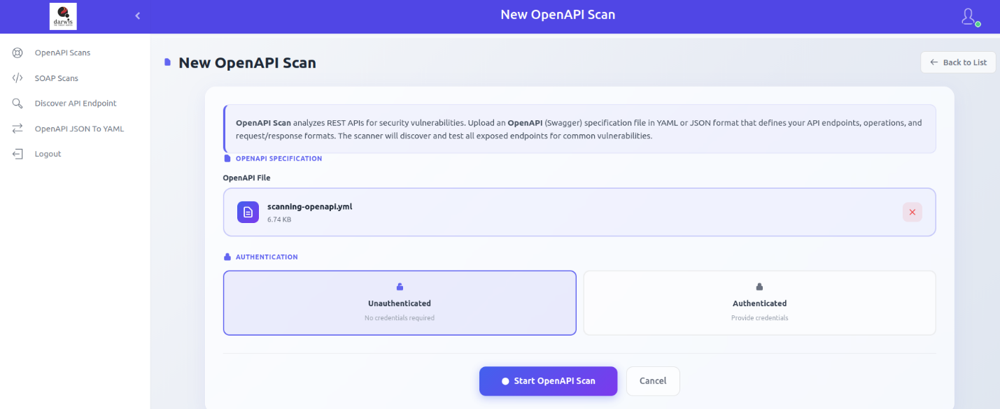

### Authenticated Scan

Tests API endpoints using valid credentials. Supported authentication methods:

- **Basic Authentication** - Username and password
- **Bearer Token** - Authorization token
- **API Key** - Custom API key header

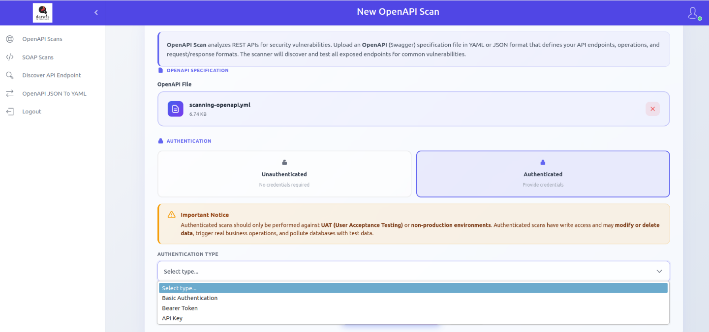

> [!WARNING]
> Only run authenticated scans on UAT or non-production environments. Authenticated scans may have write access and can modify or delete data, trigger real business actions (emails, payments), and pollute databases with test data.

After configuring the scan, click **Start OpenAPI Scan**.

> [!NOTE]
> Scans are queued and run sequentially. If other scans are pending, the new scan will start after they complete. If this is the first scan, it starts immediately.

## Viewing Scans

Click **OpenAPI Scans** in the sidebar to view all scans.

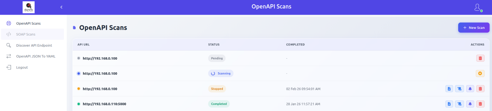

Each row shows:

| Column | Description |
|--------|-------------|
| **API URL** | The API endpoint being scanned |
| **Status** | Current scan state (see below) |
| **Completed** | Date and time the scan finished |
| **Actions** | Report, Error Logs, View Results, Delete |

### Scan Statuses

| Status | Meaning |
|--------|---------|
| Pending | Waiting for other scans to complete |
| Scanning | Currently in progress |
| Completed | Finished with report generated |
| Failed | Did not complete due to an error |
| Unreachable | Target URL cannot be accessed from the server |
| Stopped | Manually stopped by user |

### Stopping a Scan

Click the **Stop** icon on a running scan to stop it. Partial results will be generated.

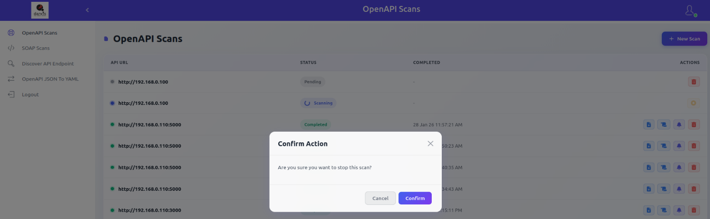

## Report

Available after scan completion. The report includes:

- Overall CVSS score and severity
- Executive summary with key findings, risk assessment, and recommendations
- CVE and CVSS metrics
- Remediation guidance and references

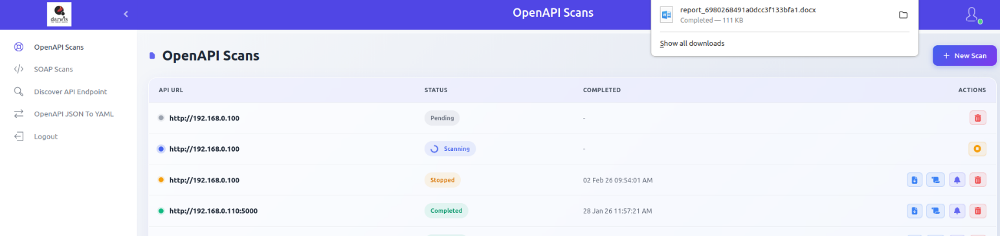

## Error Logs

During scanning, the API Scanner fuzzes the target API. If the server returns 5xx errors, the requests and responses are captured in a downloadable file.

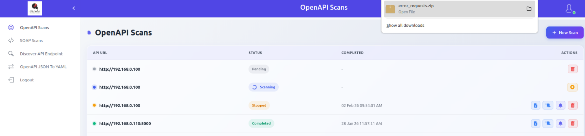

> [!NOTE]
> Error log downloads are only available when server errors were encountered during the scan.

## Scan Results

Click **View Results** to view vulnerability details within the panel. The scan results page shows:

- CVSS score chart
- Scan details
- Vulnerability count by severity: Critical, High, Medium, Low, Info

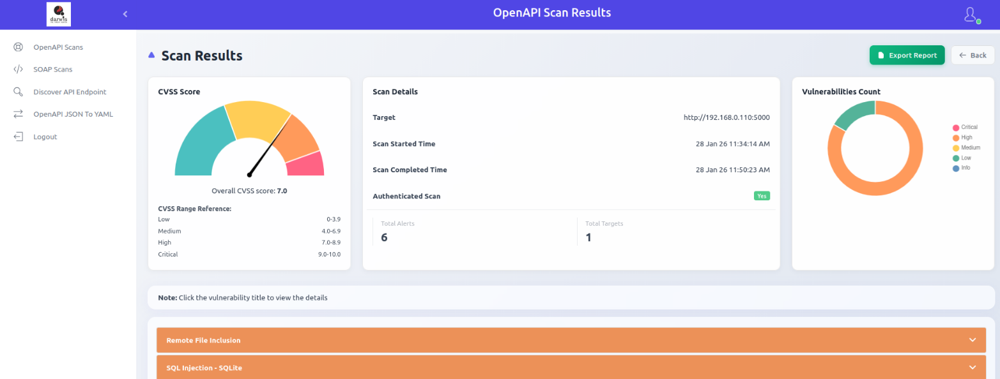

### Exporting Reports

Click **Export Report** to download scan results. Available formats:

- Excel Spreadsheet
- DOCX Report

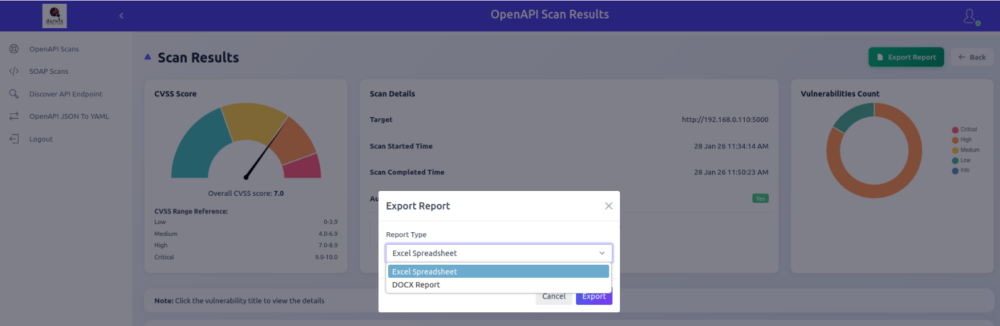

### Vulnerability Details

Click a vulnerability title to view its details.

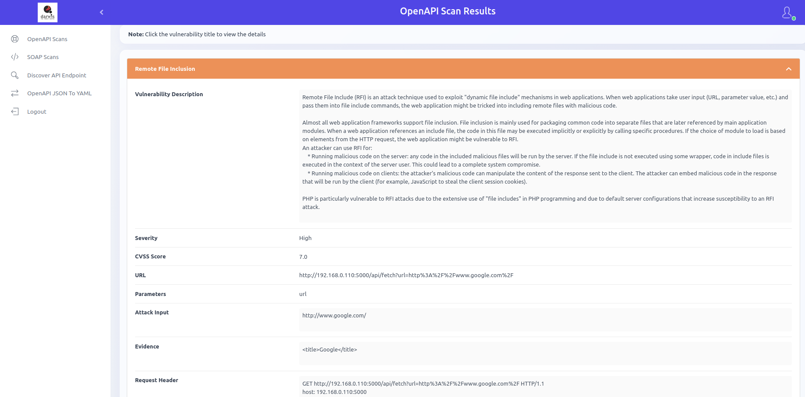

## Deleting a Scan

Click the **Delete** icon and confirm to remove a scan.

