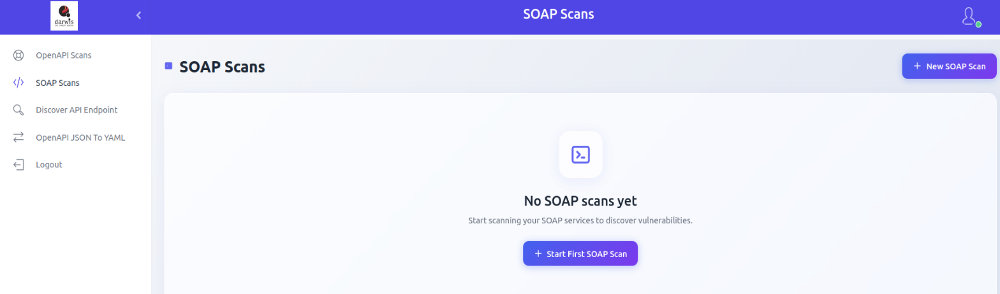
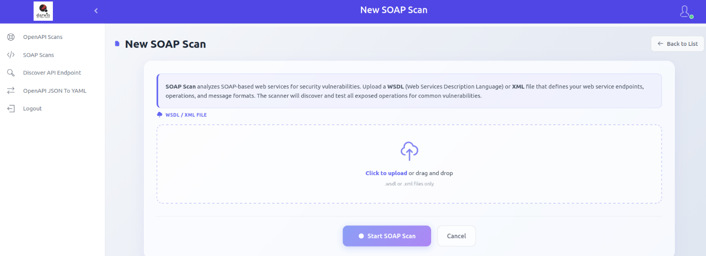
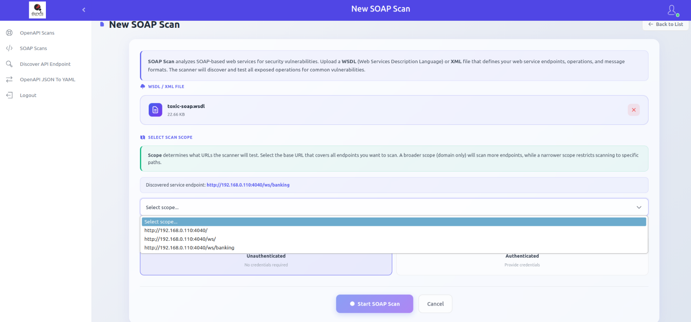
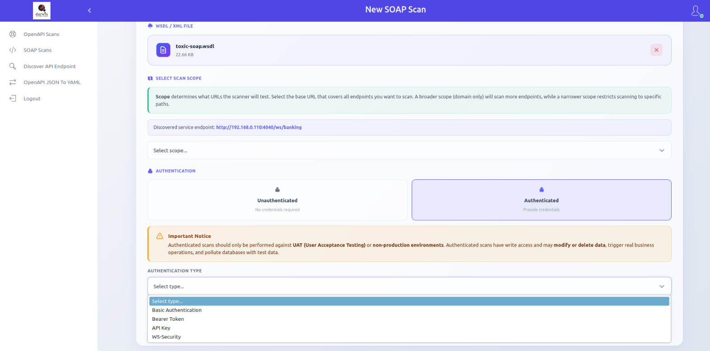
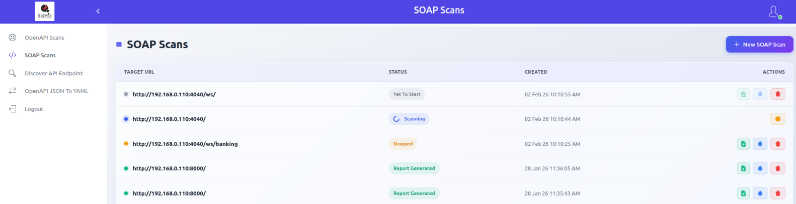

# SOAP Scan

SOAP Scan analyzes SOAP-based web services for security vulnerabilities. Upload a WSDL or XML file that defines the service, and the scanner automatically discovers and tests all exposed operations for common security issues.

## Adding a Scan

From the sidebar, click **SOAP Scans**. If no scans exist, click **Start First SOAP Scan**. Otherwise, click **New SOAP Scan** in the top-right corner.

Select a `.wsdl` or `.xml` file by clicking **Click to upload** or by dragging and dropping it. The system parses the file and discovers service endpoints.

### Scan Scope

After upload, review the discovered service endpoints. Select the appropriate scan scope from the dropdown to define which URLs and paths will be tested.

### Unauthenticated Scan

Tests SOAP operations without credentials.

### Authenticated Scan

Tests SOAP operations using valid credentials. Supported methods:

- **Basic Authentication** - Username and password
- **Bearer Token** - Authorization token
- **API Key** - Custom API key header
- **WS-Security** - SOAP-level security credentials

> [!WARNING]
> Only run authenticated scans on UAT or non-production environments. Authenticated scans may have write access and can modify or delete data, trigger real business actions (emails, payments), and pollute databases with test data.

Click **Start SOAP Scan** to begin. You will be redirected to the scan list.

## Viewing Scans

Click **SOAP Scans** in the sidebar to view all scans.

Available actions:

| Action | Description |
|--------|-------------|
| **Report** | Download scan results in document format |
| **View Results** | View scan results within the panel |
| **Delete** | Remove the scan entry |

Scan statuses, reports, scan results, and export options work the same as [OpenAPI Scan](openapi-scan.md#scan-statuses).
